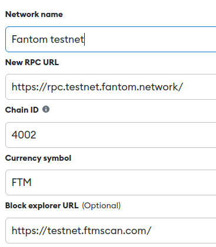

# Fantombnb
Fantom blockchain version of the famous Airbnb application

## Setting Up on Hardhat
### 1. Clone/Download the Repository

Move to folder where you want the repo to be created:

`$ git clone https://github.com/luigicallero/Fantombnb.git`

### 2. Install Dependencies:
`$ npm install`

### 3. Run tests
`$ npx hardhat test`

### 4. Start Hardhat node
`$ npx hardhat node`

### 5. Run deployment script
In a separate terminal execute:
`$ npx hardhat run ./scripts/deploy.js --network localhost`

### 6. Configure Metamask for Hardhat
You need to both configure Hardhat network and import Hardhat accounts to Metamask.

Here is a couple of links explaining how:

[Chainstack documentation](https://support.chainstack.com/hc/en-us/articles/4408642503449-Using-MetaMask-with-a-Hardhat-node)

[Medium note](https://medium.com/@kaishinaw/connecting-metamask-with-a-local-hardhat-network-7d8cea604dc6#:~:text=Chain%20ID%3A%2031337%20%E2%80%94%20This%20is,that%20is%20implemented%20by%20Hardhat.)

### 7. Start frontend
`$ npm run start`

---
## FantomBNB in Fantom Testnet Blockchain

### 1. Configure Fantom Testnet in your metamask

Metamask > Settings > Add a Network

Complete the fields with the following information:

### 2. Create an account for Fantom Testnet in your metamask
Metamask > Create Account
### 3. Request test FTM
Go to this FTM test faucet: https://faucet.fantom.network/

Request FTM for the account you created in step 2
### 4. Now log in the FantomBNB DApp
This is the link to FantomBNB DApp:

https://fantombnb.vercel.app/

---
## Useful tools for testing
### Fake Location Generator

https://fakerjs.dev/api/address.html#city

## Useful links:

* Dapp University Real State with NFTs: 
https://www.youtube.com/watch?v=cGQHXmCS94M&t=8657s
* Bumpkins Contract (role based, royalty, etc): https://polygonscan.com/token/0x624e4fa6980afcf8ea27bfe08e2fb5979b64df1c?a=28682#code#L189
* Wiki Documentation used as sample: https://sunflower-land.com/?utm_source=DappRadar&utm_medium=deeplink&utm_campaign=visit-website

## To Dos:
* Juan: Search filter to work with NFT
* Esteban: Dapp Wiki Web: Dapp link (when hosted in server) and Github Repo Link
* Luis & Juan: Update the Home.js react component with correct information
* Luis: "Provide links from https://ftmscan.com/ to your contracts".
* Luis: "Contracts for the project must be deployed, verified, and publicly readable"
* Luis: host all code in velvet
* Luis: Message: "connect your metamask to fantom blockchain to display properties information"

### Future:
* Luis: replace all mappings with a struct
* Luis: This contract could mint new NFTs
* Luis: Missing events (logged in blockchain?)
* Luis: Investigate this repo:https://github.com/kaymen99/DecentralAirbnb
* Luis: function to Update House price (deposit and price)
